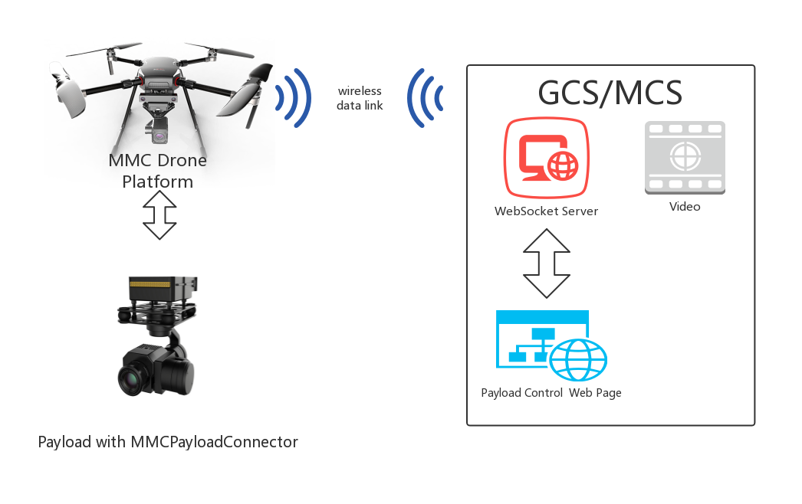

# SmartPayloadProtocol
*Every payload can mount to the MMC flight platform！*  

# About
Using MMC SmartPayloadProtocol, you can intergrate any payload devices 
including camera, sensors, speaker, gimbal and more to MMC professional 
drone platforms. 
 
# What can you do with SmartPayloadProtocol?
1. Using MMC drone platforms resources.  
Your payloads can use the power of drone platform and communicate with 
the flight control system to get valuable information such as GPS, Battery, Time, 
Attitude and more.

2. Using MMC GCS/MCS to communicate with your payloads.  
MMC GCS(ground control station)/MCS(mobile control station) can receive the 
video and data from your payloads in real time and send commands or parameters 
to contorl and setting your payloads.  

3. Design any payloads you want.  
There is a Standardized Payload Connector System using in MMC professional 
drone platform which provides Power, CAN, NET, HDMI port and more. Design your 
payloads with MMCPayloadConnector to bring your idea to the sky.

# How does it works?

# Payloads software environment requirement
Any embedded systems that support CAN communications.

# Before development
1. Introduction of [MMCPayloadConnector](./hardware/hardware.md).  
2. [Software Protocol](./protocol/protocol.md)

# Quick start
there is a [reference demo](.Demo/MMC_Payload_Demo/MMC_Payload_Demo.html).

# R&Q

# [More](http://www.mmcuav.com/)

