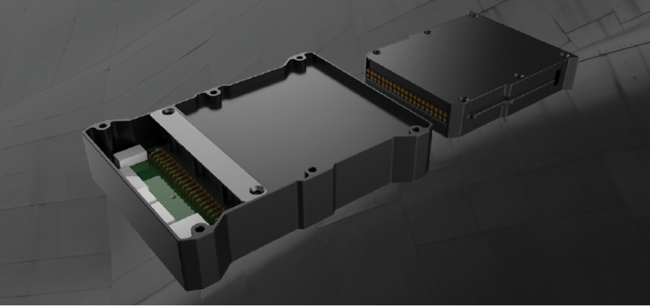
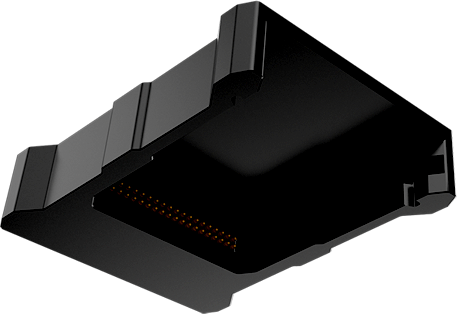
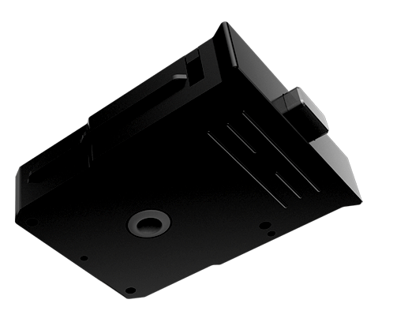
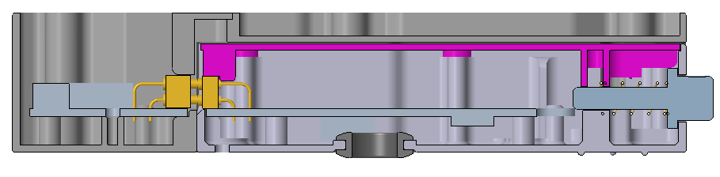
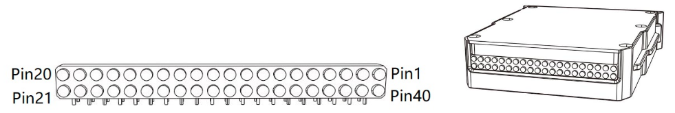
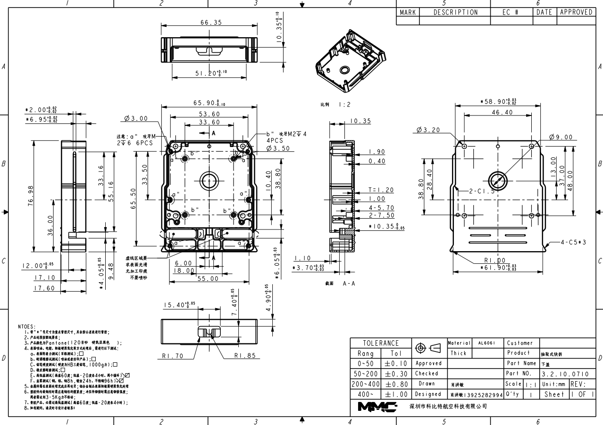
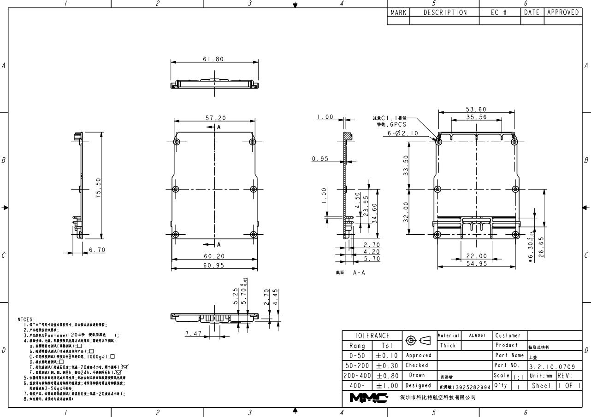

# Hardware Of MMCPayloadConnector
MMCPayloadConnector is used for mount payloads to MMC drone  platforms.
The MMCPayloadConnector consists of two parts.  

**MMCPayloadConnector-Drone**  
The MMCPayloadConnector-Drone part is Installed on every MMC drone platforms:

**MMCPayloadConnector-Payload**  
The MMCPayloadConnector-Payload part is used in every payloads whitch can 
mount to MMC drone platforms.

These two parts are electrically connected by Pogo-Pin when the Dorne and 
Payload system is working:

# Interfaces

|Interface|Signal|Note|
|---|---|---|
|CAN|CANH,CANL|2.0 A and 2.0 B Active |
|HDMI|DATA2+,DATA2-,DATA1+,DATA1-,DATA0+,DATA0-,CLOCK+,CLOCK-,CEC,HDMI_GND,HDMI_5V,HGN|Full HD supported|
|NET|TX-,TX+,RX+,RX-||
|USB|USB VCC,USB DATA+,USB DATA-|**This USB port only for payload debug**|
|UART|TX,RX|speaker payload used|

# Pins

|Pins|Definition|Desc.|
|---|---|---|
|PIN1|||
|PIN2|||
|PIN3|||
|PIN4|||
|PIN5|||
|PIN6|||
|PIN7|||
|PIN8|||
|PIN9|||
|PIN10|||
|PIN11|||
|PIN12|||
|PIN13|||
|PIN14|||
|PIN15|||
|PIN16|||
|PIN17|||
|PIN18|||
|PIN19|||
|PIN20|||
|PIN21|||
|PIN22|||
|PIN23|||
|PIN24|||
|PIN25|||
|PIN26|||
|PIN27|||
|PIN28|||
|PIN29|||
|PIN30|||
|PIN33|||
|PIN34|||
|PIN35|||
|PIN36|||
|PIN37|||
|PIN38|||
|PIN39|||
|PIN40|||

# Develop kit

# Dimensions

