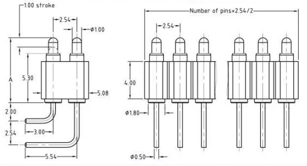
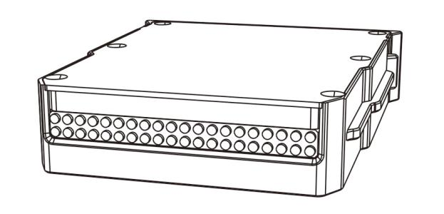
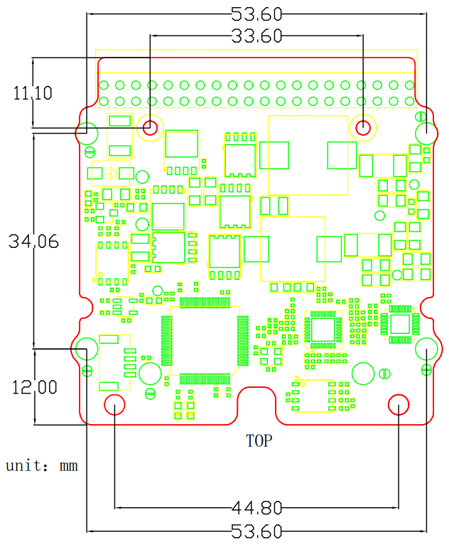
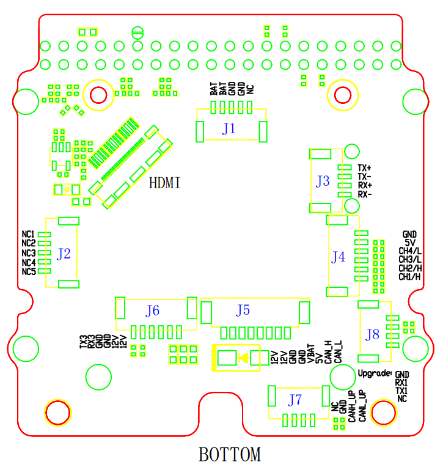
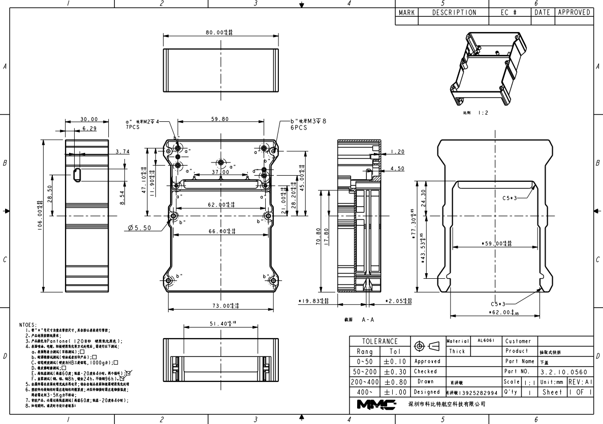

# Hardware Of MMCPayloadConnector
MMCPayloadConnector is used for mount payloads to MMC drone  platforms.
The MMCPayloadConnector consists of two parts.  

**MMCPayloadConnector-Drone**  
The MMCPayloadConnector-Drone part is Installed on every MMC drone platforms:
  

**MMCPayloadConnector-Payload**  
The MMCPayloadConnector-Payload part is used in every payloads whitch can 
mount to MMC drone platforms.This document mainly introduces 
MMCPayloadConnector-Payload.  
  
*Features*

|Item|Desc.|
|---|---|
|weight|≈83g|
|Maximum weight of Payloads|3 kg|

These two parts are electrically connected by Pogo-Pin when the Dorne and 
Payload system is working:

# Pogo-Pin

**Features**

|Item|Desc.|
|---|---|
|Current|3A/pin|
|Resistance|50mΩ MAX|
|Resilience|70g±20g/pin|

# MMCPayloadConnector interfaces

|Interface|Signal|Note|
|---|---|---|
|POWER|POWER+,GND|24~50V 3A|
|CAN|CANH,CANL|2.0 A and 2.0 B Active |
|HDMI|DATA2+,DATA2-,DATA1+,DATA1-,DATA0+,DATA0-,CLOCK+,CLOCK-,CEC,HDMI_GND,HDMI_5V,HGN|Full HD supported|
|NET|TX-,TX+,RX+,RX-|network|
|USB|USB VCC,USB DATA+,USB DATA-|**This USB port only for payload debug**|
|UART|TX,RX,GND|for speaker payload|

# Pins

|Pins|Definition|Desc.|
|---|---|---|
|PIN1-PIN3|POWER+|Power 24~50V 150w Max|
|PIN4|VUSB|USB power|
|PIN5|USBD-|USB DATA-|
|PIN6|USBD+|USB DATA+|
|PIN7|CAN1_L|CAN bus|
|PIN8|CAN1_H|CAN bus|
|PIN9|TX+|NET|
|PIN10|TX-|NET|
|PIN11|RX+|NET|
|PIN12|Rx-|NET|
|PIN13|DATA2+|HDMI TMDS|
|PIN14|DATA2-|HDMI TMDS|
|PIN15|DATA1+|HDMI TMDS|
|PIN16|DATA1-|HDMI TMDS|
|PIN17|DATA0+|HDMI TMDS|
|PIN18|DATA0-|HDMI TMDS|
|PIN19|CLOCK+|HDMI TMDS clock|
|PIN20|CLOCK+|HDMI TMDS clock|
|PIN21|CEC|HDMI CEC|
|PIN22|REV|Reserved|
|PIN23|HDMI_GND|HDMI GND|
|PIN24|HDMI_5V|HDMI power +5v|
|PIN25|HGN|Hotplug pins for monitoring the presence of HDMI devices|
|PIN26|NC6|Reserved|
|PIN27|NC5|Reserved|
|PIN28|NC4|Reserved|
|PIN29|RX-|backup of PIN12|
|PIN30|RX+|backup of PIN11|
|PIN31|TX-|backup of PIN10|
|PIN32|TX+|backup of PIN9|
|PIN33|CAN1_H|backup of PIN8|
|PIN34|CAN1_L|backup of PIN7|
|PIN35|NC3|UART RX|
|PIN36|NC2|UART TX|
|PIN37|NC1|UART GND|
|PIN38-PIN40|GND|POWER GND|

# MMC Development kit
You can get a development kit from [MMC]((http://www.mmcuav.com/)) to have a quick development.
The development kit contains the following components：  

* MMCPayloadConnector-Payload  
The MMCPayloadConnector-Payload helps you designe your own payloads which compatible with MMC 
drone platform quickly.
  
* Development board  
The development board can run MMC demo program which helps you quickly familiarize the 
software protocol during the R&D phase.The MCU on development board is STM32F405RGT6. 
Socket used on the development board is [JST-GH](../resources/JST-GH-SOCKET.pdf) and HDMI
interface on the development board is [usls-20](../resources/usls-20.pdf).  
  
  

*Development board interface info*

|No.|Name|Desc.|
|---|---|---|
|J1|Main Power|the power from drone, 24~50V 150w max|
|J2|UART|Uart from drone, connect to MMCPayloadConnector PIN35-PIN37|
|J3|NET|network port|
|J4|PWM|pwm singnal from MCU on development board|
|J5|Power and CAN2 bus|12v power and CAN2 connects MCU on development board and your payloads|
|J6|Power and UART3|12v power and UART from MCU on development board|
|J7|CAN|CAN BUS connects MMC drone platform and MCU on development board|
|J8|UART1|UART from MCU on development board |

# Dimensions

MMCPayloadConnector-Drone

MMCPayloadConnector-Payload

