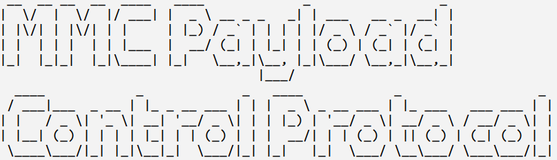
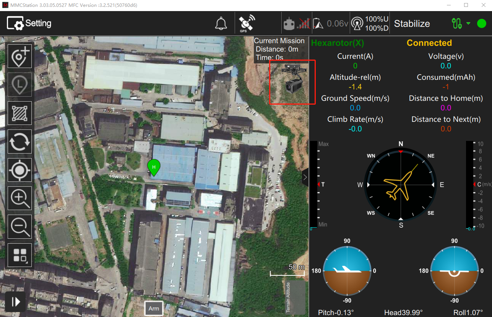
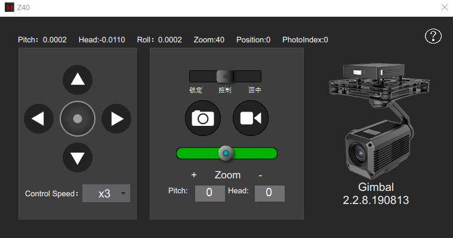
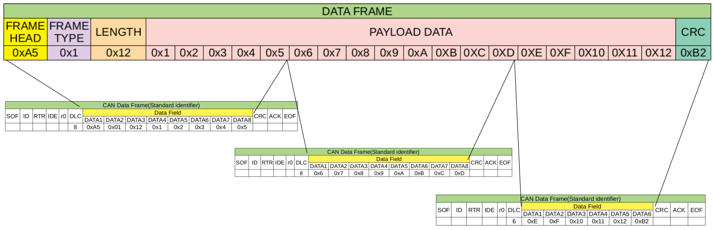
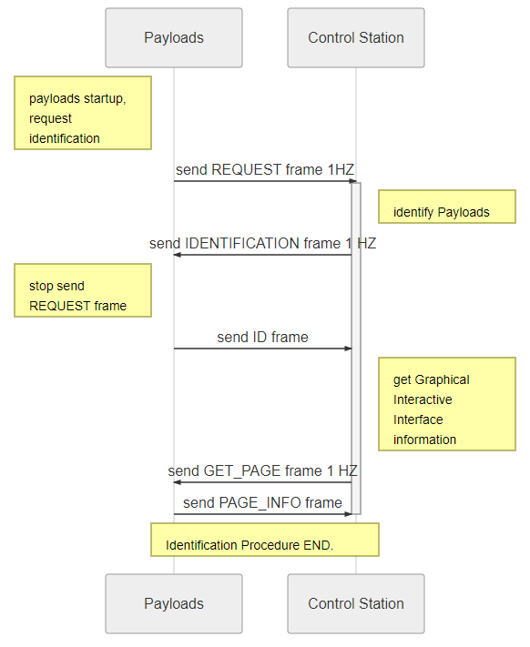
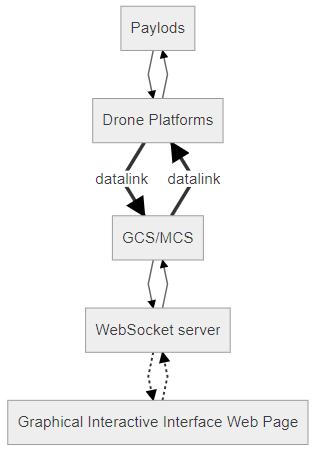

# 
# About
The purpose of the MMC Payload Control Protocol is to allow users to control 
their payloads by graphical interactive interface which designed by themselves through 
MMC drone platforms. Graphical Interactive Interface is a web page that written in 
HTML and JavaScript language and MMC GSC/MCS loads it on system working. This protocol 
is used for data transmission between payloads and ground stations, Graphical 
interactive interface web page and MMC drone platform.

*Features*  
* Custom Graphical Interactive Interface
* Data Transmission
* Video Transmission
* Get MMC drone platform state data

# Graphical Interactive Interface
Graphical Interactive Interface is used for payload control and status monitoring, It's a web 
page written in HTML and JavaScript language.There is a WebSocket server running in MMC 
GCS/MCS and its IP address is `127.0.0.1:6666`. The Graphical Interactive Interface web page 
should actively connect to the WebSocket server when it be loaded by GCS/MCS to transmit 
data with payloads.  

Custom Graphical Interactive Interface consists of two main files:  

- An HTML file describing the interface.  
- A PNG image file of Payload with a resolution of 200*200.  

These two files should be placed in the same folder and this folder should have the same
 name as the two files.The name must follow *[Payload File Name](#filename)* rules.Then put 
 them in `[MMC GCS/MCS software installation path]\payloads` folder.  
 *File structure:*  
 [MMC GCS/MCS software installation path]  
|  
|-pack  
--------|-MountWeb  
-----------------------|-[PayloadFileName]  
------------------------------------------------|-[PayloadFileName].html  
------------------------------------------------|-[PayloadFileName].png  
 
[Payload Identification Procedure](#payload_identification) is performed at MMC GCS/MCS 
and Payloads startup. Once the payload is successfully identified, the payload image will be 
displayed on the top right of the software.  
  
If the payload image is clicked by users, GCS/MCS will load the HTML web page.
  


# Data Transmission 
## Physical Layer
Data transfer based on MMCPayloadConnector hardware.
## Link Layer
CAN bus with standard identifier and 1 Mbps baudrate.  
**UPLOAD ID**  
Payloads sent data to MMC flight platform using CAN message which identifier 
ID length is 11 bits. That message ID called `UPLOAD ID`, the user can customize 
the ID, but the MSB of the ID must be set, that is, the ID range is 0x400-0x7FF. The 
`UPLOAD ID` must be different when several payloads working at the same drone platform.   
**DOWNLOAD ID**  
ID of CAN message that MMC flight platform send to payloads is called `DOWNLOAD ID`.
The ID is equal to `UPLOAD ID`&0x3FF, that is, the ID range is 0x000-0x3FF.  

## Transport Layer
Data transmission between payloads and MMC drone platform is based on data frames 
as the units. The maximum length of a data frames is 255+2 bytes. Since a CAN message 
has only 8 bytes at most, a frame of data contains several CAN message.The Data structure 
of MMC drone platform and GCS/MCS  is little endian.  

**Frame Format**  

|FRAME HEAD|FRAME TYPE|LENGTH|PAYLOAD DATA|CRC|
|------------------|---------------|-------------------|-------|------|

*Serialization*  

|Byte Index|C version|Lengh|Desc.|Value|Explanation|
|---------------|-------------|---------|-------|--------|-----------------|
| 0 | uint8_t head | 1 Byte | head of data frame | 0xA5 | Indicates the beginning of a new data frame|
| 1 | uint8_t type | 1 Byte | type of data frame | 0-255| Usage will be mentioned below|
| 2 | uint8_t len | 1 Byte | Length of data frame | 3-255| Indicates the length of the frame except FRAME HEAD and CRC filed|
| 3 to (n+2) | uint8_t payload[n] |n Byte(1<=n<=253) | payload data | | |
|n+3| uint8_t crc| 1 Byte | CRC check | 0-255 |CRC check result of data frame | 

*Note*  
- FRAME HEAD must be ***0xA5***.  
- DATA LENGTH must be greater than 3 and less than 255.    
- CRC validation begins with the `FRAME TYPE` field and ends with `PAYLOAD DATA` field, 
that is, from byte 1 to byte n+2 of the data frame. [The CRC algorithm](#crc_table).  
- The maximum length of PAYLOAD DATA is 253 bytes.  
***`PAYLOAD DATA` field must be 1-byte aligned and little-endian***

### CRC Algorithm <a name="crc_table"></a>
```
static const unsigned char crc_table[] =
{ 
	0x00,0x31,0x62,0x53,0xc4,0xf5,0xa6,0x97,0xb9,0x88,0xdb,0xea,0x7d,0x4c,0x1f,0x2e,
	0x43,0x72,0x21,0x10,0x87,0xb6,0xe5,0xd4,0xfa,0xcb,0x98,0xa9,0x3e,0x0f,0x5c,0x6d,
	0x86,0xb7,0xe4,0xd5,0x42,0x73,0x20,0x11,0x3f,0x0e,0x5d,0x6c,0xfb,0xca,0x99,0xa8,
	0xc5,0xf4,0xa7,0x96,0x01,0x30,0x63,0x52,0x7c,0x4d,0x1e,0x2f,0xb8,0x89,0xda,0xeb,
	0x3d,0x0c,0x5f,0x6e,0xf9,0xc8,0x9b,0xaa,0x84,0xb5,0xe6,0xd7,0x40,0x71,0x22,0x13,
	0x7e,0x4f,0x1c,0x2d,0xba,0x8b,0xd8,0xe9,0xc7,0xf6,0xa5,0x94,0x03,0x32,0x61,0x50,
	0xbb,0x8a,0xd9,0xe8,0x7f,0x4e,0x1d,0x2c,0x02,0x33,0x60,0x51,0xc6,0xf7,0xa4,0x95,
	0xf8,0xc9,0x9a,0xab,0x3c,0x0d,0x5e,0x6f,0x41,0x70,0x23,0x12,0x85,0xb4,0xe7,0xd6,
	0x7a,0x4b,0x18,0x29,0xbe,0x8f,0xdc,0xed,0xc3,0xf2,0xa1,0x90,0x07,0x36,0x65,0x54,
	0x39,0x08,0x5b,0x6a,0xfd,0xcc,0x9f,0xae,0x80,0xb1,0xe2,0xd3,0x44,0x75,0x26,0x17,
	0xfc,0xcd,0x9e,0xaf,0x38,0x09,0x5a,0x6b,0x45,0x74,0x27,0x16,0x81,0xb0,0xe3,0xd2,
	0xbf,0x8e,0xdd,0xec,0x7b,0x4a,0x19,0x28,0x06,0x37,0x64,0x55,0xc2,0xf3,0xa0,0x91,
	0x47,0x76,0x25,0x14,0x83,0xb2,0xe1,0xd0,0xfe,0xcf,0x9c,0xad,0x3a,0x0b,0x58,0x69,
	0x04,0x35,0x66,0x57,0xc0,0xf1,0xa2,0x93,0xbd,0x8c,0xdf,0xee,0x79,0x48,0x1b,0x2a,
	0xc1,0xf0,0xa3,0x92,0x05,0x34,0x67,0x56,0x78,0x49,0x1a,0x2b,0xbc,0x8d,0xde,0xef,
	0x82,0xb3,0xe0,0xd1,0x46,0x77,0x24,0x15,0x3b,0x0a,0x59,0x68,0xff,0xce,0x9d,0xac
};

/**
  * @brief  caculate a CRC8 check value for an array of data.  
  * @param  ptr: a pointer whitch point to the address of data.
  * @param  len: the length of data.
  * @retval CRC8 value.
  */
unsigned char cal_crc_table(unsigned char *ptr, unsigned char len) 
{
	unsigned char  crc = 0x00;
    	while (len--)
    	{
        	crc = crc_table[crc ^ *ptr++];
    	}
	return crc;
}
```

*Example*  
A Data Frame which contains 3 CAN message packets.



## Application Layer

### Payload Identification Procedure <a name="payload_identification"></a>
Payload Identification Procedure is performed at MMC GCS/MCS and Payloads startup.
The details are shown in the SequenceDiagram below.The control station(GCS/MCS) 
obtains the Payload ID and the *Graphical Interactive Interface* file information 
during the procedure, so that *Graphical Interactive Interface* can be correctly 
loaded after the procedure ends. The Payloads should provide a unique ID for 
access to the MMC cloud platform `MSpace`.  
  
*Data Frames*

* REQUEST  
Payload send `REQUEST` data frame at a frequency of 1 Hz to inform the control 
station that there is a new payload.The frame details are shown in the figure below:  

|FRAME HEAD|FRAME TYPE|LENGTH|PAYLOAD DATA|CRC|
|------------------|---------------|-------------------|-------|------|
|0xA5|0xFD|3|0x00|crc|

* IDENTIFICATION  
GCS/MCS send `IDENTIFICATION` data frame at a frequency of 1 Hz to inform Payloads 
send unique ID when GCS/MCS received the `REQUEST` data frame.The frame details 
are shown in the figure below:  

|FRAME HEAD|FRAME TYPE|LENGTH|PAYLOAD DATA|CRC|
|------------------|---------------|-------------------|-------|------|
|0xA5|0xFF|3|0x01|crc|

* ID  
Payload stop the `REQUEST` data frame and send `ID` data frame  whenever 
a `IDENTIFICATION` data frame is received.The `ID` data frame details are shown 
in the figure below:  

|FRAME HEAD|FRAME TYPE|LENGTH|PAYLOAD DATA|CRC|
|------------------|---------------|-------------------|-------|------|
|0xA5|0xFE|26|uint16_t vender_ID<br/>uint16_t payload_type</br>uint32_t UID[4]</br>uint32_t version|crc|

> vender_ID: unique vender ID, Please confirm with MMC before using this ID.  
> payload_type:the payload type define by user.  
> UID: 128bit unique payload ID, usually use the payload CPU id.  
> version:payload software version.  

* GET_PAGE  
GCS/MCS send `GET_PAGE` data frame at a frequency of 1 Hz to get 
*Graphical Interactive Interface* file name when GCS/MCS received 
the `ID` data frame. `FRAME TYPE` of this data frame is the same as 
`IDENTIFICATION` data frame.The frame details are shown in the figure below:  

|FRAME HEAD|FRAME TYPE|LENGTH|PAYLOAD DATA|CRC|
|------------------|---------------|-------------------|-------|------|
|0xA5|0xFF|3|0x02|crc|

* PAGE_INFO  
Payload send `PAGE_INFO` data frame  whenever a `GET_PAGE` data frame 
is received.The data frame details are shown in the figure below:  

|FRAME HEAD|FRAME TYPE|LENGTH|PAYLOAD DATA|CRC|
|------------------|---------------|-------------------|-------|------|
|0xA5|0xFC|n+6|uint16_t width<br/>uint16_t height</br>uint8_t filename[n]|crc|

> width:width of Graphical Interactive Interface.(Unit:pixel).  
> height:height of Graphical Interactive Interface.(Unit:pixel).  
> filename:filename of Graphical Interactive Interface page without file extension.

**FileName**<a name="filename"></a>  
The file name consists of manufacturer, payload type and payload model，and
 is connected by an underscore in the middle.  
 eg:MMC_Gimbal_Z40

### Drone Platform’s Status Data
Payloads can use the power of drone platform and communicate with the flight 
control system to get valuable information.the following data is supported:  

*Status of flight control system*  

|Status ID| Status|
|---|---|
|0x01|Flight attitude|
|0x02|Battery status|
|0x03|GPS position|

*Status of GCS/MCS*

|Status ID| Status|
|---|---|
|0x01|GCS/MCS time|

*Request Frames*  

* GET_PLATFORM_STATUS  
Payload send `GET_PLATFORM_STATUS` data frame to get Status from flight 
control system.The frame details are shown in the figure below:  

|FRAME HEAD|FRAME TYPE|LENGTH|PAYLOAD DATA|CRC|
|------------------|---------------|-------------------|-------|------|
|0xA5|0xFB|4|uint8_t Status_ID<br/>uint8_t frequency|crc|

> Status_ID: the Status ID in the above table.  
> frequency: frequency of the Status data frame.  

* GET_GCS_STATUS  
Payload send `GET_GCS_STATUS` data frame to get Status from GCS/MCS
.The frame details are shown in the figure below:  

|FRAME HEAD|FRAME TYPE|LENGTH|PAYLOAD DATA|CRC|
|------------------|---------------|-------------------|-------|------|
|0xA5|0x0B|3|uint8_t Status_ID|crc|

> Status_ID: the Status ID in the above table.  

*Status Frames*  

 The control station(GCS/MCS) or flight control system sends the status data to
 Payloads according to the requested frequency after the Payloads requests to 
 obtain the above status data, these are the status data frames:  

* ATTITUDE

|FRAME HEAD|FRAME TYPE|LENGTH|PAYLOAD DATA|CRC|
|------------------|---------------|-------------------|-------|------|
|0xA5|0xFA|15|uint8_t Status_ID<br/>float pitch<br/>float roll<br/>float yaw|crc|

> Status_ID:0x01.  
> pitch,roll,yaw: Euler angles

* BATTERY

|FRAME HEAD|FRAME TYPE|LENGTH|PAYLOAD DATA|CRC|
|------------------|---------------|-------------------|-------|------|
|0xA5|0xFA|15|uint8_t Status_ID<br/>uint8_t percentage |crc|

> Status_ID:0x02.  
> percentage: percentage of power.

* GPS

|FRAME HEAD|FRAME TYPE|LENGTH|PAYLOAD DATA|CRC|
|------------------|---------------|-------------------|-------|------|
|0xA5|0xFA|15|uint8_t Status_ID<br/>uint32_t altitude<br/>uint32_t latidute<br/>uint32_t longitude|crc|

> Status_ID:0x03.  
> altitude: altitude of drone platform.(Unit:cm)  
> latidute: the value of latidute * 10^7.  
> longitude: the value of longitude * 10^7.  

* GCS_TIME

|FRAME HEAD|FRAME TYPE|LENGTH|PAYLOAD DATA|CRC|
|------------------|---------------|-------------------|-------|------|
|0xA5|0x13|8|uint16_t year<br/>uint8_t month<br/>uint8_t day<br/>uint8_t hour<br/>uint8_t minute|crc|


### Data Transparent Transmission<a name="data_transparent_transmission"></a>
Data Transparent Transmission allows user to send custom data streams 
between the Payloads and the Graphical Interactive Interface web page.
The control station and drone platform does not parse the data field and 
transparently transmit bytes.Users can customize the data field protocol 
and parse the data for interaction on Graphical Interactive Interface web 
page using JavaScript.  
*Data Stream*  


*Data Frame*

|FRAME HEAD|FRAME TYPE|LENGTH|PAYLOAD DATA|CRC|
|------------------|---------------|-------------------|-------|------|
|0xA5|0xEF|n+2|uint8_t custom_data[n]|crc|

> custom_data: the data defined by users and maximum length is 253 bytes.   

